<div align="center">

# ✦ Discord Badge Archive

### A modern, source-first catalog of Discord badges, experiments, app indicators, and historical profile icons.

**Accurate · Searchable · Structured · Community-maintained**


</div>

> [!IMPORTANT]
> **Last verified: August 28, 2026.** This starter now includes a visual preview for every seeded badge entry, plus Nitro and Server Booster evolution visuals.

## Explore

[Profile badges](#profile-badges) ·
[Experimental](#experimental-badges) ·
[Apps & developers](#app--developer-badges) ·
[Legacy](#legacy--historical-badges) ·
[Evolving badges](#evolving-badge-series) ·
[Data](#use-the-data) ·
[Asset sources](#asset-sources)

## Why this archive exists

Most badge lists mix current badges, experiments, old screenshots, and outdated earning instructions together. This project separates the **visual archive** from the **verified data layer**, so facts can stay current even when artwork changes.

### Status language

| Label | Meaning |
|---|---|
| 🟢 **Active** | Current feature or badge |
| 🟣 **Experimental** | Discord says access is limited to an experiment |
| 🔴 **Legacy** | Historical badge that is no longer obtainable |
| ⚫ **Retired** | Feature was decommissioned or removed |

---

## Profile Badges

| Preview | Badge | Classification | Status | Availability | How to get |
|---|---|---|---|---|---|
| 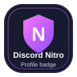 | **Discord Nitro** | `COMMON` | 🟢 Active | `OBTAINABLE` | Subscribe to an eligible Discord Nitro plan. |
| 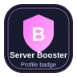 | **Server Booster** | `COMMON` | 🟢 Active | `OBTAINABLE` | Actively boost a Discord server. |
| 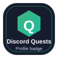 | **Discord Quests** | `COMMON` | 🟢 Active | `OBTAINABLE` | Complete an eligible Quest. |
| 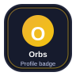 | **Orbs** | `COMMON` | 🟢 Active | `OBTAINABLE` | Purchase the badge with Orbs in the Orbs shop. |
| 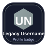 | **Legacy Username** | `COMMON` | 🟢 Active | `LIMITED` | Available only to eligible accounts from the legacy username system. |
| 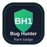 | **Bug Hunter** | `RARE` | 🟢 Active | `PROGRAM` | Participate actively in the Discord Testers community and meet its recognition criteria. |
| 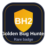 | **Golden Bug Hunter** | `RARE` | 🟢 Active | `PROGRAM` | Reach the highest Bug Hunter level through exceptional participation in Discord Testers. |
| 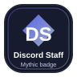 | **Discord Staff** | `MYTHIC` | 🟢 Active | `RESTRICTED` | Reserved for Discord employees. |

## Experimental Badges

| Preview | Badge | Classification | Status | Availability | How to get |
|---|---|---|---|---|---|
| 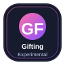 | **Gifting** | `EXPERIMENTAL` | 🟣 Experimental | `SELECTED-USERS` | Currently available only to selected users in Discord's experiment. |
| 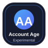 | **Account Age** | `EXPERIMENTAL` | 🟣 Experimental | `SELECTED-USERS` | Currently available only to a small subset of desktop users. |
| 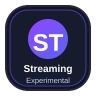 | **Streaming** | `EXPERIMENTAL` | 🟣 Experimental | `SELECTED-USERS` | Currently available only to a small subset of desktop users. |
| 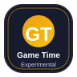 | **Game Time** | `EXPERIMENTAL` | 🟣 Experimental | `SELECTED-USERS` | Currently available only to a small subset of desktop users. |
| 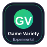 | **Game Variety** | `EXPERIMENTAL` | 🟣 Experimental | `SELECTED-USERS` | Currently available only to a small subset of desktop users. |

## App & Developer Badges

| Preview | Badge | Classification | Status | Availability | How to get |
|---|---|---|---|---|---|
| 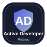 | **Active Developer** | `RETIRED` | ⚫ Retired | `UNOBTAINABLE` | No longer obtainable. |
| 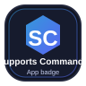 | **Supports Commands** | `APP` | 🟢 Active | `AUTOMATIC` | Register at least one global application command for the app. |
| 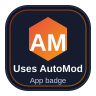 | **Uses AutoMod** | `APP` | 🟢 Active | `AUTOMATIC` | Have at least 100 AutoMod rules across all servers for the app. |

## Legacy & Historical Badges

| Preview | Badge | Classification | Status | Availability | How to get |
|---|---|---|---|---|---|
| 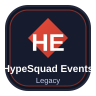 | **HypeSquad Events** | `LEGACY` | 🔴 Legacy | `UNOBTAINABLE` | No longer obtainable. |
| 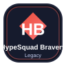 | **HypeSquad Bravery** | `LEGACY` | 🔴 Legacy | `UNOBTAINABLE` | No longer obtainable. |
| 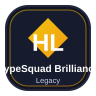 | **HypeSquad Brilliance** | `LEGACY` | 🔴 Legacy | `UNOBTAINABLE` | No longer obtainable. |
| 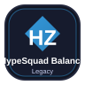 | **HypeSquad Balance** | `LEGACY` | 🔴 Legacy | `UNOBTAINABLE` | No longer obtainable. |
|  | **Moderator Program Alumni** | `LEGACY` | 🔴 Legacy | `UNOBTAINABLE` | No longer obtainable. |
| 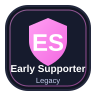 | **Early Supporter** | `LEGACY` | 🔴 Legacy | `UNOBTAINABLE` | No longer obtainable. |
| 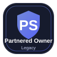 | **Partnered Server Owner** | `LEGACY` | 🔴 Legacy | `UNOBTAINABLE` | No longer obtainable. |
| 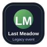 | **Last Meadow Online** | `LEGACY` | 🔴 Legacy | `UNOBTAINABLE` | No longer obtainable. |

## Evolving Badge Series

### Nitro

| Tier | Preview | Months |
|---|---|---|
| **Bronze** | 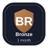 | 1 month |
| **Silver** | 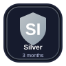 | 3 months |
| **Gold** | 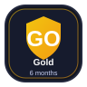 | 6 months |
| **Platinum** | 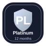 | 12 months |
| **Diamond** | 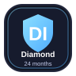 | 24 months |
| **Emerald** | 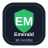 | 36 months |
| **Ruby** | 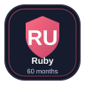 | 60 months |
| **Opal** | 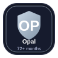 | 72+ months |

### Server Booster

| Level | Preview | Requirement |
|---|---|---|
| **Level 1** | 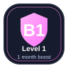 | 1 month boost |
| **Level 2** | 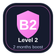 | 2 months boost |
| **Level 3** | 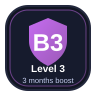 | 3 months boost |
| **Level 4** | 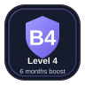 | 6 months boost |
| **Level 5** | 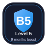 | 9 months boost |
| **Level 6** | 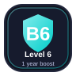 | 1 year boost |
| **Level 7** | 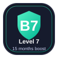 | 15 months boost |
| **Level 8** | 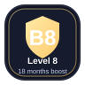 | 18 months boost |
| **Level 9** | 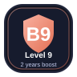 | 2 years boost |

## Use the Data

The source of truth lives in [`data/badges.json`](data/badges.json). Each seeded badge includes an `asset` field pointing to its local preview image.

```python
import json

with open("data/badges.json", encoding="utf-8") as f:
    archive = json.load(f)

for badge in archive["badges"]:
    print(badge["name"], badge["asset"])
```

## Asset Sources

- File-by-file asset list: [`docs/ASSET_SOURCES.md`](docs/ASSET_SOURCES.md)
- Asset notes: [`assets/README.md`](assets/README.md)
- Main project sources: [`docs/SOURCES.md`](docs/SOURCES.md)

## Disclaimer

This is an independent community archive and is **not affiliated with, endorsed by, or sponsored by Discord Inc.** Discord and related marks belong to their respective owners.
